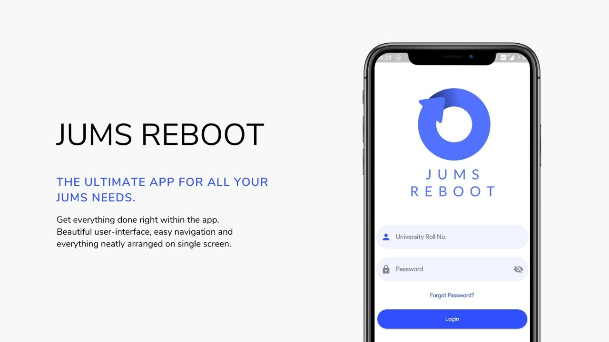

# 
 JUMS Reboot

#

## What is JUMS Reboot?

#

## Features
1. Save your documents offline, so that you can access it even if you are offline.
2. Login with your University Credentials
3. In-App updates, get notified about new versions, and update without leaving the app
4. Simple UI

## Screenshots

#
## Tech Used
* App - Flutter
* Server - Node with Express
* Scraping - Puppeter

## Packages Used
* cached_network_image
* firebase_messaging
* flutter_full_pdf_viewer
* firebase_core 
* flutter_spinkit 
* font_awesome_flutter
* http
* in_app_update
* package_info
* path_provider
* share
* share_extend
* shared_preferences
* url_launchers